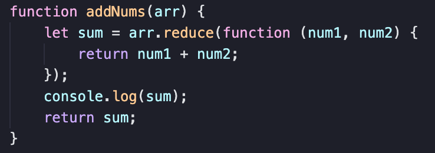
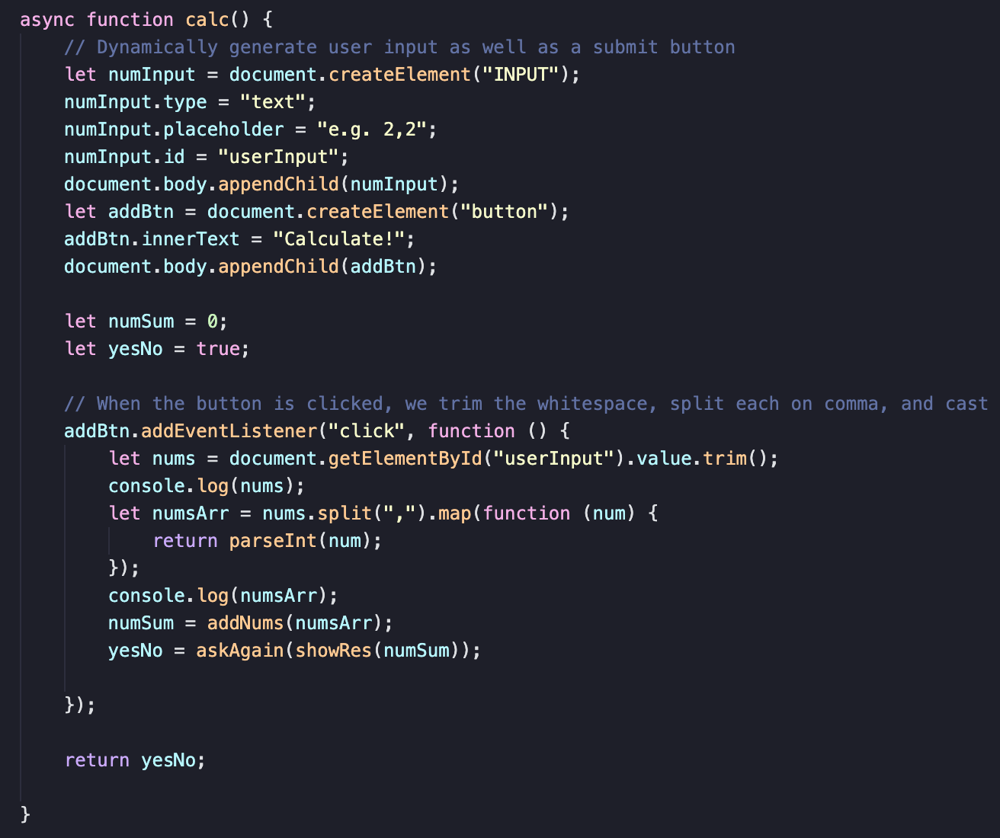
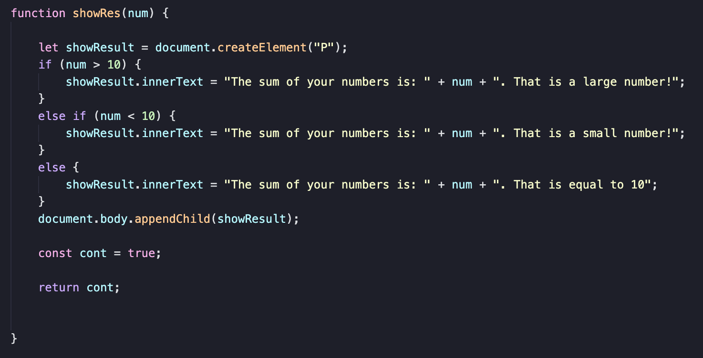
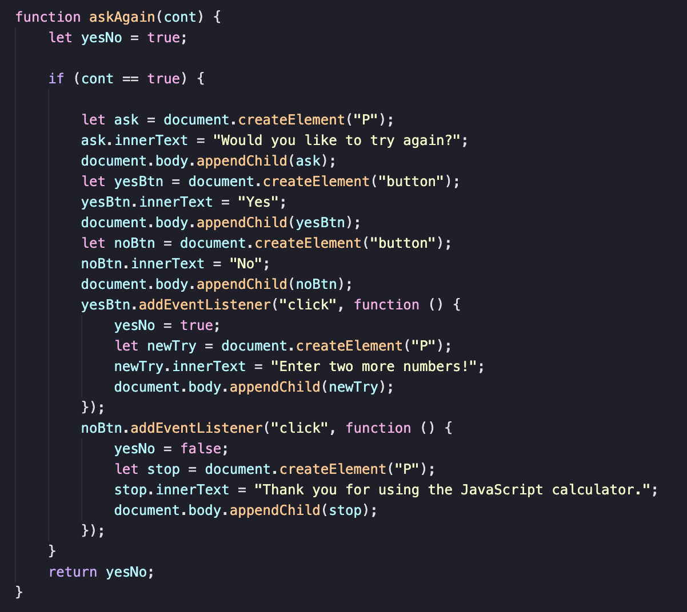
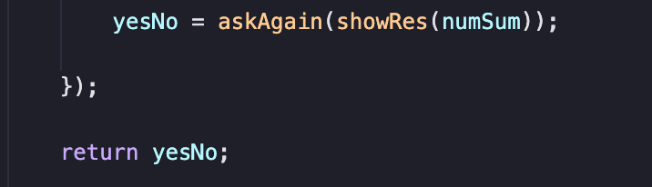
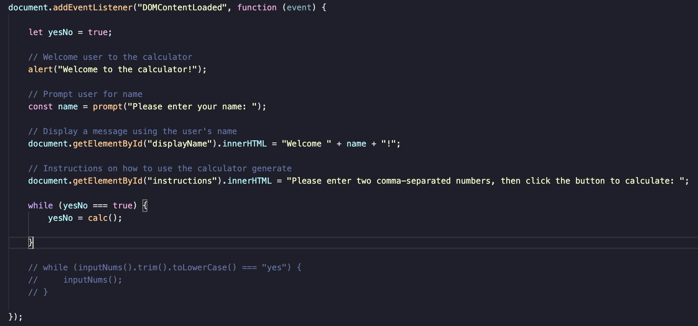
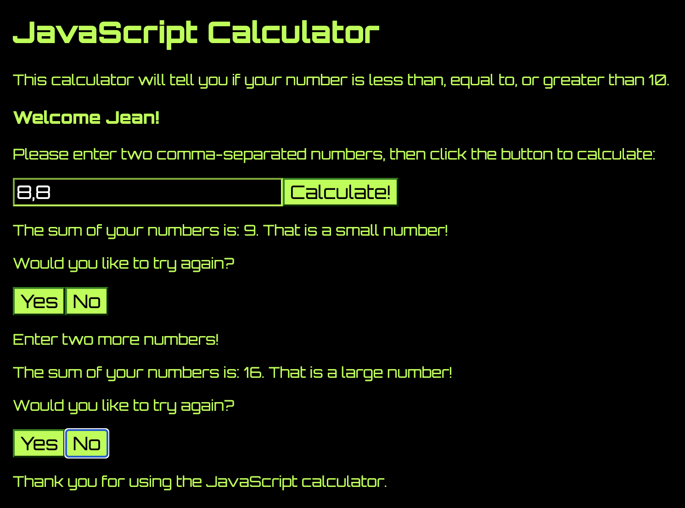

# BUMETCS-601-Calculator
A simple Javascript calculator that will tell you if the sum of your two entered numbers is less than or greater than 10. Created by Jean Shalenkova for CS601 at Boston University, 2021.

## Concept
This is a pseudocalculator that takes in two comma-separated values from the user and tells the user if their number is less than, equal to, or greater than 10. 

1. The user is greeted with an alert.
2. The user is prompted to enter their name in a popup. That name is then displayed in a welcome message on the web page.
    1. From this point, all communication with users is through dynamically created page elements (I got way too annoyed testing with alerts and prompts and felt I demonstrated my ability to code them). 
4. An input bar pops up with instructions to input two comma-separated values, as well as a button that will trigger the calculation. 
4. Once the calculation is complete, the user can see the result of their addition (is the number >, =, < 10)
5. The user is then asked if they would like to try again. If they choose the Yes button, a message generates to input two more values, and another calculation will be performed. If they choose the No button, the user is thanked for using the Javascript calculator and no more calculations will occur.

At the heart of it is the addNums() method, which uses a reducer method to reduce down an array by addition and returns the sum:

This method is called in a button-click event listener in the calc() method:

The calc() method creates an input area for the user with a "Calculate!" button to the side. Upon button click, the value of the input area will be collected, then split on comma with whitespace trimmed, and each number is parsed to an integer. This becomes the array that we pass into the addNums() method. We then pass the resulting sum to the showRes() method, which will determine whether the number is greater than, less than, or equal to 10 and display an appropriate resulting message on the page:

This method also contains a boolean that will be passed to the askAgain() method to force JavaScript to wait for the return of this method before continuing. askAgain() asks the  user if they would like to enter another number and creates two buttons, each having an event listener that will set the boolean that will control our while loop to true or false:

The return  value of askAgain() is collected inside calc(), where it is called, and that becomes the return  method of calc()...

... and the return value of calc is used to control the boolean that controls the while loop in our "main" event listener, which runs when the DOM is loaded:

## Style

I didn't have much time to work on an intricate stylesheet this week so I just tried my best to make this thing look futuristic with old computer terminal vibes to give it a techy, calculator-y feel:

## Struggles
I really, really struggled with getting my while loop to run without errors and getting everything to synchronize properly without running out of order. I also got tired of working with popups FAST so I decided I'd rather take the extra time to display everything rather than just doing alerts and prompts.